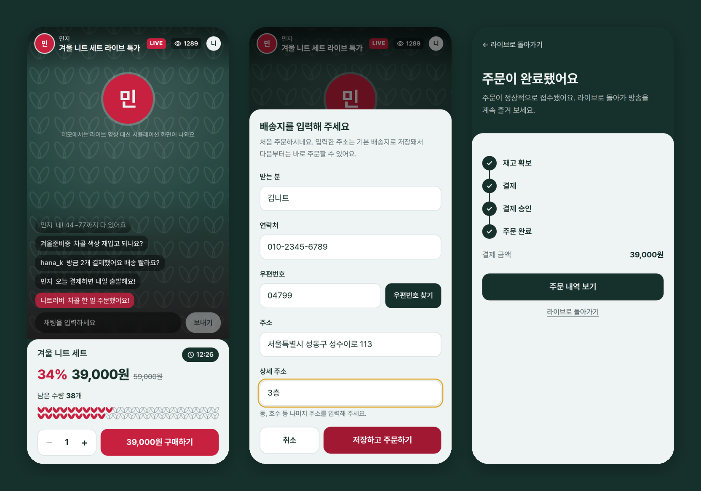
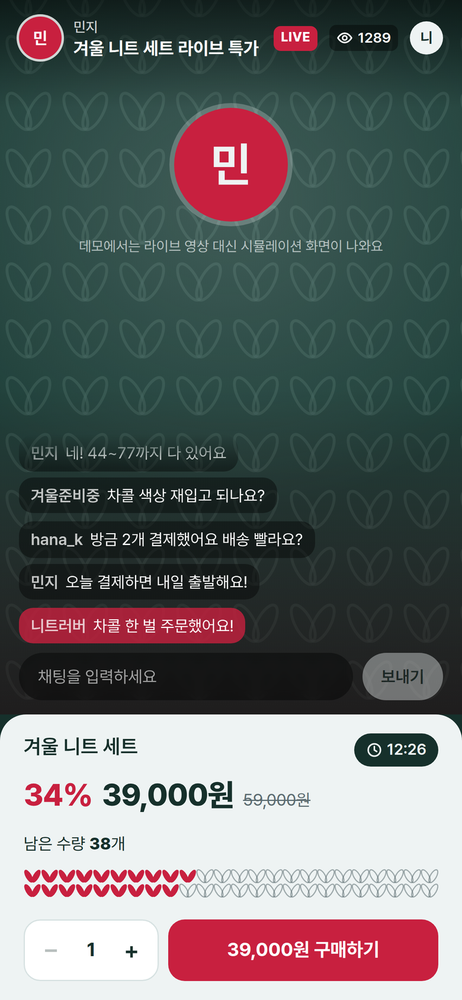
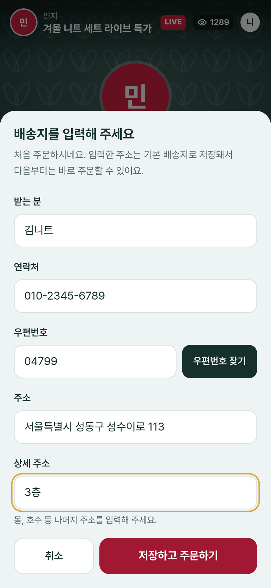
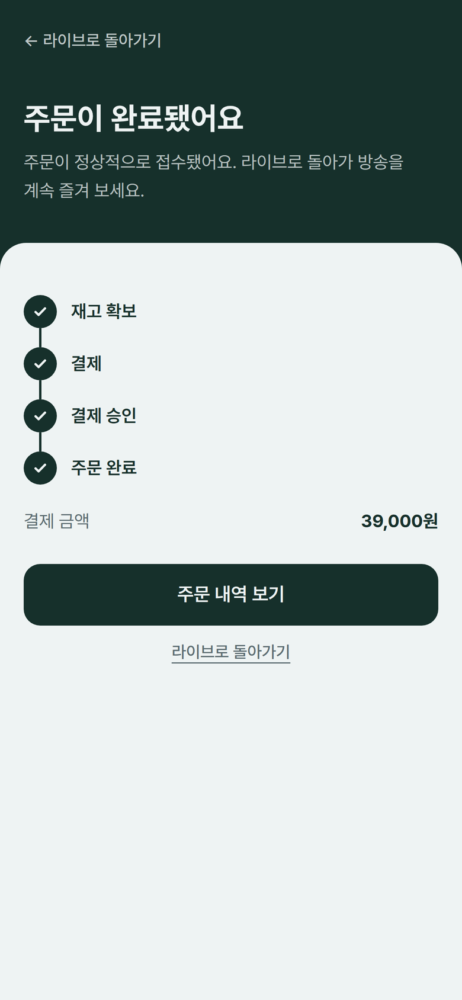
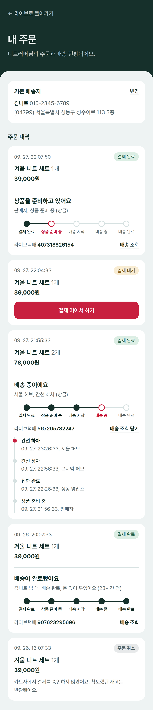
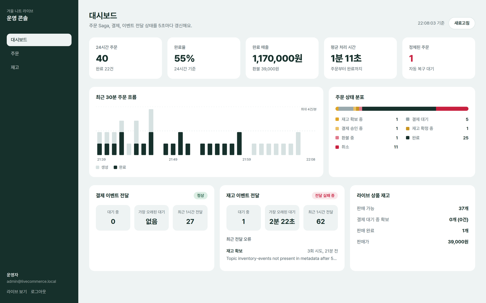
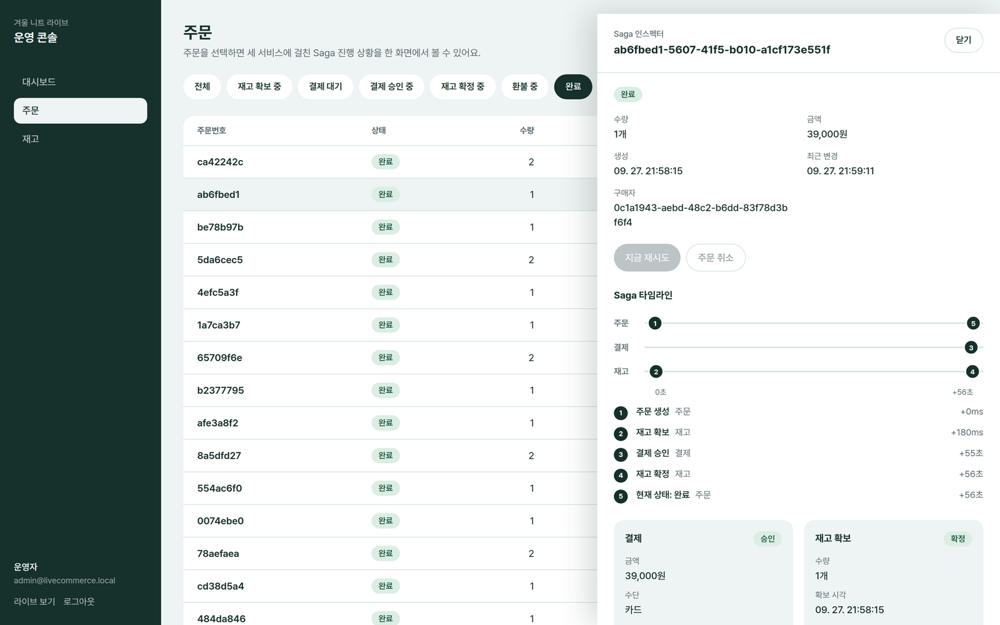
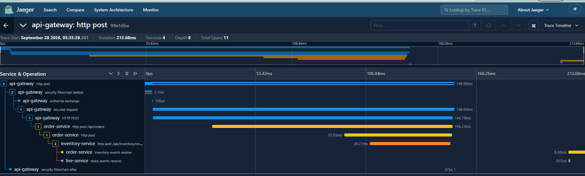

# LiveCommerce Saga

라이브 방송 중 한정 수량 특가(플래시 세일)를 처리하는 라이브 커머스 플랫폼입니다. 주문·결제·재고를 독립된 Spring Boot 마이크로서비스로 나누고, **Saga 오케스트레이션**과 **Transactional Outbox**로 분산 트랜잭션의 정합성을 보장합니다. 결제는 Toss Payments로 처리합니다.

**한국어** | [English](README.en.md)

**Live Demo:** https://live.javohir.dev · 화면 언어: 한국어(기본) / English / O'zbekcha



<sub>화면은 로컬 환경에서 데모 데이터로 촬영했습니다. 분산 트레이싱 화면과 부하 테스트 수치는 실제 실행 결과입니다.</sub>

## 한눈에 보기

| 항목 | 결과 |
| --- | --- |
| 구매 시도 1,000건 · 재고 100개 동시 경쟁 | 초과 판매 0건, 결제 건수와 판매 수량 불일치 0건, HTTP 오류 0건 (3회 반복 측정) |
| 성능 개선 | 판매 완료까지 1분 27초 → 약 23초, 주문 생성 p95 5.72초 → 2.68초 |
| 장애 복구 | Kafka·DB 중단 카오스 테스트에서 이벤트 유실 0건, 이중 결제 0건 |
| 실시간 방송 | 동시 시청자 500명, 재고 변경 알림 도달률 99.2%, 시청자 수 메시지 98% 감소 |
| 테스트 | 통합 테스트 22개, 카오스 테스트 3개, k6 부하 테스트 3종 |

## 핵심 설계

- **재고 선점 후 결제(hold-then-pay) Saga**: 재고를 10분간 선점한 뒤 결제를 받습니다. 품절 상품에 대한 결제와 환불이 원천적으로 발생하지 않습니다.
- **Transactional Outbox**: 상태 변경과 이벤트를 하나의 DB 트랜잭션에 기록하고, 브로커가 수신을 확인한 이벤트만 발행 완료로 표시합니다. Kafka가 중단되어도 이벤트가 유실되지 않습니다.
- **멱등성**: Toss 승인 API에 `Idempotency-Key`를 사용하고, 결제·재고는 `order_id` 기준으로 멱등하며, 주문 상태 전이는 허용된 이전 상태에서만 `@Version`과 함께 수행됩니다.
- **금액 위변조 방지**: 결제 금액은 서버가 계산하며, 클라이언트가 보낸 금액이 다르면 Toss 호출 전에 `AMOUNT_MISMATCH`로 거절합니다.
- **보안 경계**: Gateway가 JWT를 검증하고 신원 헤더를 재작성합니다. 리프레시 토큰은 매번 교체되며, 재사용이 감지되면 세션 전체를 폐기합니다.
- **택배 웹훅**: HMAC 서명, 재전송 공격 차단, 중복 이벤트 제거, 순서가 뒤바뀐 이벤트에도 상태가 역행하지 않습니다.
- **관측 가능성**: Outbox가 W3C `traceparent`를 함께 저장해 Kafka를 거치는 Saga 전체가 하나의 트레이스로 이어집니다.

## 기술 스택

| 영역 | 기술 |
| --- | --- |
| Backend | Kotlin, Spring Boot 3.3, Spring Cloud Gateway, Spring Data JPA, Spring Kafka, WebSocket/STOMP |
| Data | PostgreSQL 16 (서비스별 독립 DB), Apache Kafka 3.9 (KRaft), Flyway |
| Observability | Micrometer Tracing, OpenTelemetry, Jaeger |
| Frontend | Next.js 14, TypeScript, Tailwind CSS, Toss Payments SDK |
| Test | JUnit 5 통합·카오스 테스트, k6 |

## 아키텍처

```
Browser ── Next.js ── API Gateway (JWT) ─┬─ auth-service
                                         ├─ order-service (Saga 오케스트레이터)
                                         ├─ live-service (STOMP: 채팅, 재고, 시청자 수)
                                         └─ delivery-service (배송, 택배 웹훅)

order-service ── REST ──> inventory-service ──(outbox)──> Kafka ──> order-service
order-service ── REST ──> payment-service ──> Toss Payments
                               └────────(outbox)──> Kafka ──> order-service
order-service ──(outbox)──> Kafka ──> delivery-service ──> 택배 웹훅
inventory-service ──(outbox)──> Kafka ──> live-service ──> 시청자 브라우저
```

| 서비스 | 포트 | 역할 |
| --- | --- | --- |
| `api-gateway` | 8080 | 단일 진입점, JWT 검증, 권한 확인, 라우팅, WebSocket 프록시 |
| `order-service` | 8081 | 주문 Saga 오케스트레이션, 주문 상태 WebSocket, 복구 스케줄러 |
| `payment-service` | 8082 | Toss Payments 승인·취소 |
| `inventory-service` | 8083 | 재고 선점·확정·반환, 선점 만료 처리 |
| `live-service` | 8084 | 라이브 채팅, 실시간 재고, 시청자 수 |
| `auth-service` | 8085 | 회원가입, 로그인, RS256 JWT, JWKS, 리프레시 토큰, 기본 배송지 |
| `delivery-service` | 8086 | 배송 생성, 택배 웹훅 수신, 택배사 시뮬레이터 |

서비스마다 독립된 PostgreSQL을 사용하며, 서비스 간 데이터 조회는 API나 이벤트로만 이루어집니다.

## 주문 Saga: 재고 선점 후 결제

```
AWAITING_STOCK → AWAITING_PAYMENT → PAYMENT_CONFIRMING → CONFIRMING_STOCK → COMPLETED
       ↓                ↓                  ↓                    ↓
   CANCELLED        CANCELLED          CANCELLED       COMPENSATING → CANCELLED
```

1. 구매자가 `POST /api/orders`를 보냅니다. 요청에는 상품, 수량, 배송지만 있고 가격은 없습니다. 주문은 `AWAITING_STOCK` 상태로 생성됩니다.
2. inventory가 재고를 10분간 선점(`HELD`)하고 `InventoryReserved` 이벤트에 단가를 담아 보냅니다. order-service가 금액을 직접 계산해 주문을 `AWAITING_PAYMENT`로 전환합니다. 결제 기한은 5분이며, 선점 만료보다 최소 60초 먼저 닫힙니다.
3. 구매자가 Toss 결제창에서 결제하면 브라우저가 `paymentKey`와 금액을 `POST /api/orders/{id}/payment`로 보냅니다. 금액이 서버 계산과 다르면 `AMOUNT_MISMATCH`로 거절합니다.
4. payment-service가 Toss `/v1/payments/confirm`을 `Idempotency-Key`와 함께 호출합니다. 외부 HTTP 호출은 DB 트랜잭션 밖에서 수행하고, 결과는 Outbox 이벤트와 함께 하나의 트랜잭션에 기록합니다.
5. 결제가 승인되면 inventory가 선점을 확정(`CONFIRMED`)하고 주문은 `COMPLETED`가 됩니다. 주문 완료 이벤트는 order-service의 Outbox를 통해 delivery-service로 전달되어 배송이 시작됩니다.

**이 순서를 택한 이유**: 플래시 세일에서 품절은 예외가 아니라 일상입니다. 결제를 먼저 받고 재고를 확인하면 품절될 때마다 환불이 발생하고, 이는 구매자 경험과 PG 수수료 모두에 비용입니다. 재고를 먼저 선점하면 환불은 선점 만료와 결제가 경합하는 드문 경우로 한정됩니다.

## 화면

### 라이브 방송



재고 표시는 단순한 진행 막대가 아니라 두 줄의 뜨개 코로 표현됩니다. 판매될수록 코가 풀리고, 재고가 20% 아래로 내려가면 색이 바뀌며 "마감 임박"이 표시됩니다. 채팅 작성자는 클라이언트가 보낸 값이 아니라 STOMP `CONNECT` 시 검증한 토큰에서 가져옵니다.

### 배송지 입력과 결제

 

첫 구매 시 배송지를 입력하면 기본 배송지로 저장되고 주문이 바로 이어집니다. 주소는 Daum(Kakao) 우편번호 서비스로 검색합니다. 재고가 선점되면 주문 시트 안에서 Toss Payments 위젯이 열리고, 결제 후에는 Saga 진행 단계가 실시간으로 표시됩니다.

### 내 주문과 배송 조회



완료된 주문마다 결제 완료 → 상품 준비 중 → 배송 시작 → 배송 중 → 배송 완료 단계와 택배사, 운송장 번호, 배송 조회 이력을 보여 줍니다. 배송 상태는 배송 완료 전까지 실시간으로 갱신되고, 완료 후에는 조회를 멈춥니다.

### 운영 콘솔





`/admin`은 `ADMIN` 권한에만 열립니다. 대시보드는 주문 수, 전환율, 매출, 평균 처리 시간, 정체된 주문, 분당 주문 추이와 서비스별 Outbox 상태를 5초마다 갱신합니다. **Saga 인스펙터**는 한 주문이 주문·결제·재고 세 서비스를 거친 과정을 시간 축 위에 보여 주며, 점의 색은 이벤트가 Kafka에 전달되었는지를 나타냅니다. 운영자는 정체된 단계를 즉시 재시도하거나, 미결제 주문을 취소하고, 재고와 가격을 수정할 수 있습니다.

### 분산 트레이싱



하나의 주문 요청이 gateway → order → inventory → Kafka → order·live로 이어지는 실제 트레이스입니다. 부하가 없을 때 재고 선점부터 order-service가 이벤트를 받기까지 약 65ms가 걸립니다.

## 장애 시나리오와 복구

| 장애 | 시스템의 동작 | 검증 |
| --- | --- | --- |
| Kafka 중단 | Outbox 릴레이는 브로커가 수신을 확인한 뒤에만 `PUBLISHED`로 표시합니다. 그 전까지 이벤트는 `PENDING`으로 남아 재전송됩니다 | `chaosTest`: Kafka 중단 중 생성된 주문이 복구 후 결제되어 `COMPLETED` |
| 결제 승인 중 payment DB 중단 | 주문은 `PAYMENT_CONFIRMING`에 머물고 복구 스케줄러가 승인을 재시도합니다. Toss에 같은 `Idempotency-Key`로 요청하므로 이중 결제가 없습니다 | `chaosTest`: DB 복구 후 결제 1건만 기록되고 `COMPLETED` |
| inventory 무응답 | 재고 선점을 3회 재시도한 뒤 결제 없이 주문을 취소합니다 | `chaosTest`: `inventory step timed out`, 결제 0건 |
| 카드 승인 거절 | 주문을 취소하고 선점한 재고를 즉시 반환합니다 | `SagaEndToEndTest` |
| 클라이언트의 금액 변조 | `AMOUNT_MISMATCH`(400), Toss로 요청이 전혀 나가지 않습니다 | `SagaEndToEndTest` |
| 구매자가 결제하지 않음 | 결제 기한이 지나면 주문을 취소하고 재고를 반환합니다. order-service가 멈춰도 inventory의 자체 스위퍼가 만료된 선점을 반환합니다 | 복구 스케줄러, `HoldExpiryScheduler` |
| 결제 승인 시점에 선점 만료 | inventory가 `InventoryConfirmFailed`를 보내고 주문은 `COMPENSATING`을 거쳐 Toss로 환불됩니다 | 오케스트레이터 로직 |
| 같은 메시지 중복 수신 | 상태 전이는 허용된 이전 상태에서만 가능하고(`@Version`), 결제·재고는 `order_id` 기준으로 멱등합니다 | `IdempotencyTest` |
| 취소 후 늦게 도착한 응답 | 취소된 주문에 대한 `PaymentConfirmed`는 환불을, `InventoryReserved`는 재고 반환을 일으킵니다 | 오케스트레이터 로직 |
| 반환된 선점에 대한 확정 시도 | 확정을 거절하고 재고는 변하지 않습니다 | `IdempotencyTest` |

## 부하 테스트와 성능 개선

`load-test/k6/`의 세 스크립트는 모두 gateway를 통해 실제 사용자를 가입시켜 실행합니다. 결제 단계는 `fake_approve_*` 키를 사용해 Toss에 부하를 주지 않습니다. 외부 PG API는 부하 테스트 대상에 포함하지 않아야 합니다.

| 스크립트 | 검증 내용 |
| --- | --- |
| `smoke.js` | 구매자 1명으로 주문 → 재고 선점 → 결제 → 완료 → 배송 생성 → 내 주문까지 전체 흐름을 확인합니다 |
| `flash-sale.js` | `BUYERS`건의 구매 시도가 `STOCK`개의 재고를 두고 동시에 경쟁합니다. 지연 시간과 판매 결과를 측정합니다 |
| `live-viewers.js` | `VIEWERS`명의 시청자가 STOMP로 접속한 상태에서 구매가 재고를 바꿉니다. 접속 성공률, 접속 시간, 재고 알림 도달률을 측정합니다 |

`flash-sale.js`는 속도만 재지 않습니다. 테스트가 끝나면 운영 API로 다음 불변식을 검증하며, 하나라도 깨지면 테스트는 실패합니다.

- 판매 수량이 판매 가능 재고를 넘지 않는다(초과 판매 없음)
- 가용 재고는 음수가 되지 않는다
- 재고는 보존된다: `가용 + 선점 + 판매 = 판매 개시 재고`
- 판매된 모든 수량은 완료된 주문에 속한다
- 결제 건수는 완료 주문 수와 같다. 상품 없이 돈만 빠져나간 구매자는 없다

### 측정 결과와 개선 과정

모든 서비스, PostgreSQL 5개, Kafka, Jaeger를 노트북 한 대에서 실행해 측정했습니다. 따라서 수치는 운영 환경의 처리량이 아니라 아키텍처의 상대적인 동작을 보여 줍니다.

첫 측정은 정합성을 증명했습니다. 200명의 동시 구매자가 재고 100개를 두고 경쟁했을 때 정확히 100명이 구매했고, 결제도 100건이었으며, 42,448개의 요청에서 HTTP 오류는 0건이었습니다. 반면 속도는 부족했고, 수치가 원인을 가리켰습니다.

| 발견 | 원인 | 개선 |
| --- | --- | --- |
| 주문 생성 p95 약 5.8초 | 품절 이후에도 모든 요청이 상품 행의 `FOR UPDATE` 잠금을 기다렸습니다 | 잠금 전에 잠금 없는 스칼라 조회로 품절을 즉시 거절합니다. 엔티티를 먼저 조회하면 Hibernate가 이후 `FOR UPDATE`에서 1차 캐시의 오래된 엔티티를 반환해 초과 판매가 생길 수 있으므로, 숫자 하나만 조회합니다 |
| 재고 선점 p95 17.8초 | 토픽마다 파티션 1개, 컨슈머 스레드 1개로 이벤트가 적체되었습니다 | 토픽을 파티션 6개로 선언하고 order-service가 6개 스레드로 소비합니다. 키는 `orderId`이므로 주문 단위의 순서는 보장됩니다 |
| Saga 단계마다 추가 지연 | Outbox 릴레이가 500ms 주기로 조회하고 이벤트를 한 건씩 확인하며 전송했습니다 | 100ms 주기, 배치를 병렬 전송한 뒤 확인, `linger.ms=5`. 연속으로 성공한 앞부분만 `PUBLISHED`로 표시하고 나머지는 재전송합니다. 중복은 생길 수 있어도 유실은 없습니다 |
| 시청자 500명에 시청자 수 메시지 454,583건 | 접속할 때마다 모든 시청자에게 인원 수를 보냈습니다(O(n²)) | 인원 수가 바뀐 경우에만 초당 최대 1회 전송합니다 |
| order-service의 커넥션 대기 | 기본 커넥션 10개가 컨슈머 스레드 12개와 HTTP 요청을 감당하지 못했습니다 | Hikari 풀 30개 |

**측정 방법**: 설정마다 워밍업 실행 1회를 버리고 3회 측정의 중앙값을 기록했습니다. 노트북 한 대에서는 실행 간 편차가 ±25%에 달했고, 서비스를 재시작한 직후의 첫 실행은 JIT 컴파일과 커넥션 풀 초기화 때문에 몇 배 느렸습니다.

| 지표 (재고 100개, 구매 시도 1,000건, 200 VU) | 개선 전 | 개선 후 (3회 중앙값) |
| --- | --- | --- |
| 불변식 | 5/5 통과 | 5/5 통과 (3회 모두) |
| 판매 / 결제 | 100 / 100 | 100 / 100 |
| HTTP 오류 | 0 / 42,448 | 0 |
| 주문 생성 p95 | 5.72초 | 2.68초 (−53%) |
| 결제 요청 p95 | 0.71초 | 0.63초 |
| 재고 선점까지 p95 | 17.77초 (15초 이후 미측정, 절삭된 값) | 4.80초 |
| 주문 완료까지 p95 | 33.55초 (100건 중 47건만 측정) | 11.04초 |
| 전체 판매 소요 시간 | 1분 27초 | 약 23초 (−74%) |

개선 전 지연 시간은 절삭된 값입니다. 첫 측정에서 k6가 느린 주문을 15~20초 이후 기다리지 않아 통계에서 빠졌기 때문에, 실제 개선 폭은 표보다 큽니다.

| 지표 (시청자 500명) | 개선 전 | 개선 후 |
| --- | --- | --- |
| STOMP 접속 | 571 / 571 | 500 / 500 |
| 접속 p95 | 423ms | 1.55초 (30초 동안 500명 접속) |
| 시청자 수 메시지 | 454,583 | **8,151 (−98%)** |
| 재고 변경 알림 도달 | 측정 불가 (테스트가 재고를 복구하지 않음) | **120,000 / 약 121,000 (99.2%)** |

### 실험으로 기각한 가설과 얻은 교훈

- **커넥션 풀 가설 기각**: 남은 지연의 원인을 inventory의 커넥션 부족(Hikari 기본 10개)으로 추정했습니다. 코드 변경 없이 `SPRING_DATASOURCE_HIKARI_MAXIMUMPOOLSIZE=30`으로 같은 방식으로 측정한 결과 주문 생성 p95 2.77초, 재고 선점 p95 5.41초, 완료 p95 10.46초로 편차 범위 안이었습니다. 효과가 없으므로 설정을 반영하지 않았습니다.
- **파티션 증설 시 컨슈머 메타데이터**: 토픽을 처음 6개 파티션으로 늘렸을 때, 먼저 실행된 컨슈머가 새 파티션을 보지 못했습니다. 컨슈머는 기본적으로 5분마다 메타데이터를 갱신하기 때문입니다(`metadata.max.age.ms`). 이벤트는 유실되지 않고 재시작 후 모두 처리되었지만, 그동안 주문이 정체되었습니다. 이제 브로커 기본 파티션 수(`KAFKA_NUM_PARTITIONS=6`)도 6으로 설정해 어떤 서비스가 먼저 실행되어도 토픽이 올바르게 생성됩니다. 운영 환경에서는 토픽을 배포 전에 인프라 단계에서 생성해야 합니다.
- **불변식 보정**: 초과 판매 불변식은 처음에 `판매 ≤ STOCK`이었습니다. 실제 측정에서 101 > 100으로 실패했지만 재고 보존 불변식은 통과했습니다. 이전 실행에서 남은 선점 1개가 테스트 중 만료되어 정상적으로 판매된 것이었습니다. 불변식을 `판매 ≤ STOCK + 테스트 시작 시 선점 수량`으로 바로잡았습니다.
- **품절 즉시 거절의 트레이드오프**: 잠금 없는 조회가 0을 본 순간 다른 주문이 재고를 반환 중이라면 해당 구매자는 품절 응답을 받을 수 있습니다. 반환된 재고는 다음 구매자에게 즉시 열리며 초과 판매는 절대 일어나지 않으므로, 플래시 세일에서는 올바른 선택입니다.

**다음 개선 후보**: 남은 지연의 대부분은 주문 생성 요청 안에서 inventory를 동기 REST로 호출하는 구간과 단일 머신의 CPU 경합에서 옵니다. 재고 선점도 Outbox 기반 Kafka 커맨드로 바꾸면 주문 생성 응답을 수십 ms로 줄일 수 있지만, Saga의 첫 단계가 비동기가 되는 아키텍처 변경이므로 이번 범위에는 포함하지 않았습니다.

## 서비스별 상세

### 인증과 API Gateway

Access token은 RS256으로 서명한 15분짜리 JWT(`sub`, `nickname`, `roles`)입니다. gateway와 live-service는 auth-service의 JWKS 엔드포인트로 서명을 검증하므로, 비밀 키는 한 서비스에만 존재합니다.

Refresh token은 JWT가 아닌 32바이트 난수이며, DB에는 SHA-256 해시만 저장하고 브라우저에서는 `HttpOnly`, `SameSite=Strict` 쿠키로만 전달됩니다. 갱신할 때마다 교체(rotation)되고, 이미 사용된 토큰이 다시 오면 탈취로 간주해 같은 세션 계열 전체를 폐기합니다. 이 폐기가 오류 응답 시에도 유지되도록 트랜잭션에 `noRollbackFor`를 지정했습니다. 로그인 시 존재하지 않는 이메일도 비밀번호 해시를 계산해, 응답 시간으로 가입 여부를 알 수 없게 했습니다.

신뢰 경계: gateway는 클라이언트가 보낸 `X-User-Id`, `X-User-Roles` 헤더를 항상 제거하고 검증된 토큰으로만 다시 씁니다. 운영 API는 gateway에서 `ADMIN`만 허용하고, 각 서비스도 역할 헤더를 다시 확인하므로 gateway를 우회해도 열리지 않습니다. 다른 사용자의 주문은 403이 아닌 404로 응답해 존재 여부도 드러내지 않습니다.

데모 관리자 계정은 최초 실행 시 자동 생성됩니다: `admin@livecommerce.local` / `admin1234!`

### 결제 (Toss Payments)

payment-service는 Toss Payments 실제 API(승인 `/v1/payments/confirm`, 취소 `/v1/payments/{paymentKey}/cancel`)를 `Basic base64(secretKey:)` 인증과 `Idempotency-Key`(`confirm-{orderId}`, `cancel-{orderId}`)로 호출합니다. 기본 설정은 Toss 공개 문서의 테스트 키를 사용하므로 실제 출금이 없습니다. 개인 테스트 키는 프런트엔드 `frontend/.env.local`의 `NEXT_PUBLIC_TOSS_CLIENT_KEY`와 payment-service 환경 변수 `PAYMENTS_TOSS_SECRET_KEY`에 같은 쌍으로 지정합니다. 라이브 키 전환은 PG 계약과 사업자등록이 필요하며, 코드 변경 없이 설정만 바꾸면 됩니다.

자동화 테스트는 결제창에 카드 정보를 입력할 수 없으므로, `payments.fake-enabled=true`일 때 `fake_`로 시작하는 `paymentKey`는 테스트용 게이트웨이로 보냅니다(`fake_approve_*` 승인, `fake_decline_*` 거절). 운영에서는 반드시 꺼야 합니다.

### 라이브 방송 (live-service)

| 채널 | 경로 | 설명 |
| --- | --- | --- |
| REST | `GET /api/live/session` | 방송, 상품, 가격, 현재 재고, 특가 종료 시각, 시청자 수 |
| REST | `GET /api/live/chat` | 최근 채팅 50개 |
| STOMP | `/ws/live` | WebSocket 엔드포인트 |
| STOMP | `/app/live/chat` | 채팅 전송 |
| STOMP | `/topic/live/chat`, `/topic/live/stock`, `/topic/live/viewers` | 채팅, 재고, 시청자 수 구독 |

재고가 바뀔 때마다 inventory가 같은 트랜잭션 안에서 `StockChanged` 이벤트를 Outbox에 기록합니다. 키가 `productId`이므로 한 상품의 변경은 Kafka에서 순서대로 전달되고, live-service가 이를 모든 시청자에게 브로드캐스트합니다. 표시 가격과 결제 가격은 모두 inventory의 단가 한 곳에서 나옵니다.

### 배송 (delivery-service)

주문이 `COMPLETED`가 되면 order-service가 `OrderCompleted` 이벤트를 상태 변경과 같은 트랜잭션으로 Outbox에 기록하고, delivery-service가 운송장 번호를 발급해 배송을 생성합니다. 배송지는 주문 시점에 주문에 스냅숏으로 복사되므로, 이후 프로필을 바꿔도 지난 주문에 영향이 없습니다.

상태: `PREPARING`(상품 준비 중) → `SHIPPED`(배송 시작) → `IN_TRANSIT`(간선 이동) → `OUT_FOR_DELIVERY`(배송 출발) → `DELIVERED`(배송 완료)

택배사는 `POST /api/deliveries/webhooks/courier`로 상태 변경을 보냅니다.

| 문제 | 해결 |
| --- | --- |
| 위조 요청 | `X-Courier-Signature: sha256=HMAC(secret, timestamp.body)`, `MessageDigest.isEqual`로 상수 시간 비교 |
| 가로챈 요청의 재전송 | `X-Courier-Timestamp`가 5분보다 오래되면 거절 |
| 택배사의 중복 전송 | `event_id` 유니크, 중복은 `DUPLICATE`로 응답하고 처리하지 않음 |
| 순서가 뒤바뀐 이벤트 | 늦게 온 과거 이벤트는 이력에만 기록(`RECORDED_OUT_OF_ORDER`)하고 상태는 역행하지 않음 |
| 같은 배송에 대한 동시 웹훅 | 배송 행을 `SELECT ... FOR UPDATE`로 잠금 |

웹훅은 gateway에서 JWT 없이 열려 있고 서명으로 보호됩니다. 데모용 택배사 시뮬레이터는 외부 회사처럼 자체 테이블에 상태를 두고, 각 단계를 서명된 HTTP 요청으로 같은 웹훅에 보냅니다.

### 운영 API

| 경로 | 서비스 | 기능 |
| --- | --- | --- |
| `GET /api/admin/orders?status=&page=&size=` | order | 주문 목록, 상태 필터 |
| `GET /api/admin/orders/summary` | order | 상태별 건수, 매출, 24시간 전환율, 정체 주문, 평균 처리 시간, 분당 추이 |
| `POST /api/admin/orders/{id}/retry` | order | 정체된 Saga 단계 즉시 재시도 |
| `POST /api/admin/orders/{id}/cancel` | order | 미결제 주문 취소(재고 즉시 반환) |
| `GET /api/admin/payments/orders/{id}` | payment | 결제 수단, 승인 시각, 거절 코드 |
| `GET /api/admin/payments/summary` | payment | 결제 건수, 승인·환불 금액 |
| `GET /api/admin/inventory/products`, `PUT .../products/{id}` | inventory | 가용·선점·판매 수량 조회, 재고와 가격 수정 |
| `GET /api/admin/inventory/reservations/{orderId}` | inventory | 주문의 재고 선점 기록과 만료 시각 |
| `GET /api/admin/{payments,inventory}/outbox?aggregateId=` | payment, inventory | 주문 관련 Outbox 이벤트(Saga 이벤트 로그) |
| `GET /api/admin/{payments,inventory}/outbox/health` | payment, inventory | 대기 이벤트 수, 가장 오래된 대기 시간, 최근 오류 |

통계 쿼리는 JPA 대신 `JdbcTemplate`과 PostgreSQL `FILTER`, `date_trunc`로 작성해 엔티티를 메모리에 올리지 않고 한 번의 쿼리로 집계합니다.

### 프런트엔드

`frontend/`는 Next.js 14(App Router), TypeScript, Tailwind로 만든 모바일 우선 클라이언트입니다.

- REST는 Next.js rewrites로 gateway에 프록시되어 CORS 문제가 없고 리프레시 쿠키가 같은 도메인에 머뭅니다.
- Access token은 localStorage가 아닌 메모리에만 두고, 새로고침 시 리프레시 쿠키로 조용히 복원하며 만료 전에 자동 갱신합니다. 동시에 발생한 여러 401은 하나의 갱신 요청으로 합칩니다.
- 주문 상태는 WebSocket으로 받고 3초 주기의 보조 조회를 함께 사용합니다. 상태는 앞으로만 진행하므로 늦게 온 이전 메시지가 화면을 되돌리지 않습니다.
- Saga 단계(재고 확보 → 결제 → 결제 승인 → 주문 완료)를 사용자에게 그대로 보여 주고, 실패하면 어느 단계에서 멈췄는지와 자동 환불 여부를 안내합니다.
- React StrictMode에서 이펙트가 두 번 실행되어도 Toss 위젯의 렌더링과 해제를 순차 처리해 결제 UI가 겹치지 않습니다.
- Pretendard 글꼴과 `word-break: keep-all`로 한국어 줄바꿈을 다듬었고, `prefers-reduced-motion`과 `aria-live` 안내를 지원합니다.
- 방송 영상 자체(RTMP/HLS)는 범위 밖이며 시뮬레이션 화면으로 대체합니다. `NEXT_PUBLIC_LIVE_VIDEO_URL`을 지정하면 해당 영상을 재생합니다.

## 실행 방법

필요 도구: JDK 21, Docker, Node.js 18.17 이상. Gradle은 저장소의 wrapper(`gradlew`)를 사용합니다.

```powershell
.\gradlew assemble
powershell -ExecutionPolicy Bypass -File scripts\start-services.ps1
```

스크립트는 PostgreSQL 5개, Kafka, Jaeger를 띄우고 각 서비스를 이름이 붙은 창에서 실행한 뒤 모든 포트가 준비될 때까지 기다립니다. 중지는 `scripts\stop-services.ps1`(컨테이너까지 중지하려면 `-Infrastructure`)이며, 이 프로젝트의 서비스만 종료하고 IDE 등 다른 Java 프로세스는 건드리지 않습니다. 전체를 Docker로 실행하려면 `docker compose up --build`를 사용합니다.

```powershell
cd frontend
npm install
npm run dev
```

브라우저에서 http://localhost:3000 을 열고, 운영 콘솔은 http://localhost:3000/admin, Jaeger는 http://localhost:16686 입니다.

### 테스트

```powershell
.\gradlew :integration-test:test
.\gradlew :integration-test:chaosTest
```

통합 테스트는 실행 중인 스택에 실제 HTTP 요청을 보내고 결과를 각 서비스 DB에서 직접 검증합니다. 정상 흐름, 재고 부족 보상, 멱등성, 인증과 권한, 운영 API, 배송과 택배 웹훅 보안을 다룹니다. 카오스 테스트는 Kafka와 DB를 실제로 중단했다가 재시작합니다.

```powershell
winget install k6 --source winget
cd load-test\k6
k6 run smoke.js
k6 run -e STOCK=100 -e BUYERS=1000 -e VUS=200 -e USERS=200 flash-sale.js
k6 run -e VIEWERS=500 live-viewers.js
```

### 요청 예시

```powershell
$login = Invoke-RestMethod -Method Post -Uri http://localhost:8080/api/auth/login -ContentType "application/json" -Body '{"email":"admin@livecommerce.local","password":"admin1234!"}'
$headers = @{ Authorization = "Bearer $($login.accessToken)" }
$body = '{"productId":"11111111-1111-1111-1111-111111111111","quantity":1,"shippingAddress":{"recipientName":"김니트","phone":"010-1234-5678","zipCode":"04799","address1":"서울특별시 성동구 성수이로 113","address2":"3층"}}'
$order = Invoke-RestMethod -Method Post -Uri http://localhost:8080/api/orders -Headers $headers -ContentType "application/json; charset=utf-8" -Body ([System.Text.Encoding]::UTF8.GetBytes($body))
Start-Sleep -Seconds 2
$payable = Invoke-RestMethod -Uri "http://localhost:8080/api/orders/$($order.orderId)" -Headers $headers
$payment = @{ paymentKey = "fake_approve_demo"; amount = $payable.amount } | ConvertTo-Json
Invoke-RestMethod -Method Post -Uri "http://localhost:8080/api/orders/$($order.orderId)/payment" -Headers $headers -ContentType "application/json" -Body $payment
```

## 운영 배포

라이브 데모는 VPS 한 대에서 Docker Compose로 실행합니다.

```bash
cp .env.prod.example .env
docker compose -f docker-compose.prod.yml up -d --build
```

- `Dockerfile.prod`는 Gradle 빌드를 한 번만 수행하고, 서비스마다 별도의 런타임 이미지를 만듭니다. 모든 JVM은 root가 아닌 사용자로 실행되며 컨테이너 메모리 한도를 기준으로 힙을 잡습니다.
- 외부에서 접근할 수 있는 컨테이너는 `edge`(Caddy) 하나뿐입니다. `/api/*`와 `/ws/*`는 API Gateway로, 나머지는 Next.js로 전달합니다. PostgreSQL, Kafka, Jaeger와 각 서비스의 포트는 외부에 노출하지 않습니다.
- 운영 환경에서는 관리자 계정(`ADMIN_EMAIL`, `ADMIN_PASSWORD`), DB 비밀번호, 택배 웹훅 서명 키를 반드시 `.env`로 지정해야 하며, 없으면 컨테이너가 시작되지 않습니다. 리프레시 토큰 쿠키는 `Secure`로 설정됩니다.
- 부하 테스트용 가짜 결제(`fake_` 키)는 운영에서 기본적으로 꺼져 있습니다(`PAYMENTS_FAKE_ENABLED=false`).
- 트레이스 샘플링 비율은 메모리 사용량을 고려해 20%로 낮췄습니다.

## 알려진 한계

- 부하 테스트 수치는 노트북 한 대에서 모든 구성 요소를 함께 실행한 결과입니다.
- live-service의 채팅 이력과 시청자 수는 메모리에 있어 단일 인스턴스로 동작합니다. 수평 확장하려면 Redis로 옮기고 인스턴스별 컨슈머 그룹이 필요합니다.
- JWT 서명 키는 시작할 때마다 새로 생성됩니다. 리프레시 토큰으로 사용자는 알아채지 못하지만, 운영에서는 KMS나 Vault에서 불러와야 합니다.
- 결제는 테스트 키로 동작하며, 방송 영상은 시뮬레이션 화면입니다.

## 프로젝트 구조

```
livecommerce-saga/
├── common/             이벤트 계약, 배송지 검증 규칙
├── api-gateway/        JWT 검증, 라우팅, WebSocket 프록시
├── auth-service/       회원·토큰·JWKS, 기본 배송지
├── order-service/      Saga 오케스트레이터, 주문 WebSocket, Outbox
├── payment-service/    Toss Payments 승인·취소, Outbox
├── inventory-service/  재고 선점·확정·반환, 만료 스위퍼, Outbox
├── live-service/       STOMP 채팅·재고·시청자 수
├── delivery-service/   배송, 택배 웹훅, 택배사 시뮬레이터
├── integration-test/   통합·카오스 테스트
├── load-test/k6/       부하 테스트 스크립트와 측정 결과
├── frontend/           Next.js 클라이언트
└── scripts/            로컬 스택 실행·중지 스크립트
```
